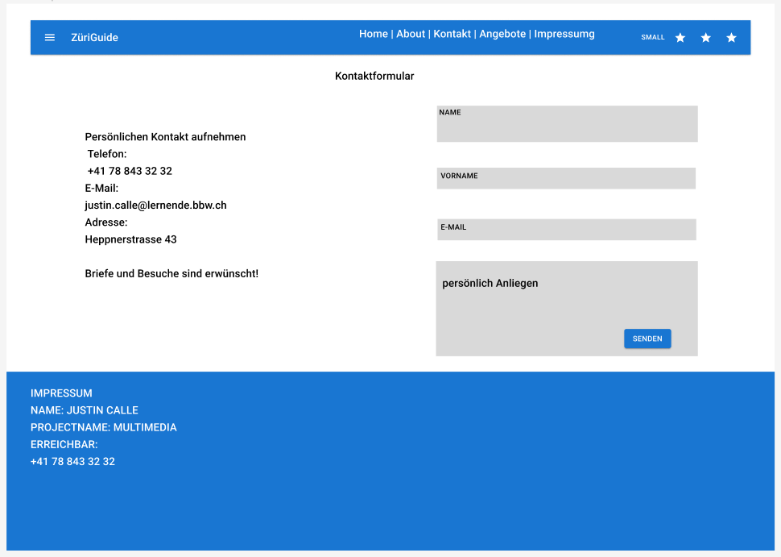

# Dokumentation Multimedia

| Bezeichnung    | Angaben        |
| -------------- | ---------------|
| Autor:         | Justin Calle   |
| Erstellt am:   | 15.5.2023      |
| Git-Repo-URL   | [Repository](https://github.com/justindavidcalle/multimediaprojekt) |
| Miro-URL   | [Board](https://miro.com/welcomeonboard/NFk4QVFTc1VudlVqMlY2dGoydFY5TDBTNkJQd1hVdXFLSVZaQjJvUmZUWlJkaGhxOFBuRGZrcW9DVlJYWDBvTXwzNDU4NzY0NTIyMTAyMzg3OTk0fDI=?share_link_id=426388507797) |

## Einleitung
Wir haben den Auftrag bekommen, für eine Gmbh nach unserer Wahl eine Website erstellen. In dieser Dokumentation werden alle Schritte dargestellt, für die Umsetzung dieses Projekts.

### Toolauswahl für diese Umsetzung
Bei der Toolauswahl habe ich mich Schlussendlich für Adobe Photoshop, Adobe Lightroom entschieden, um die Bilder zu bearbeiten. Dies hat den Vorteil, das keine Kosten fallen, da die Schule uns ein Abonnement organisiert haben. Es gibt aber auch viele andere Tools, die zur Bearbeitung hilfen. Hier sind einige Beispiele:
* inPixio
* movavi
* Canva
* PhotoDirector 365

Ein weiterer Grund, warum ich mich für die Adobe Programme entschieden habe, ist auch die Umgebung an sich, denn einige Freunde von mir haben früher schone mit Adobe gearbeitet. Somit Sprach es mich an und ich war schon etwas etabliert in das System. Desweiteren gibt es hervoragende Bildbibliotheken, mit welcher schon eine Vorlage hat und das Bearbeiten um einiges schneller macht. Einige andere Programme haben dies auch, aber es Sticht nicht so heraus wie Adobe dies tut mit ihrer Einfachheit.Dies habe ich strukturiert bewertet und kritisiert mit einer Nutzwertanalyse. Diese half mir, die Entscheidung zu treffen und brach mir Stützung, als ich der gleichen Meinung war.

## Ablauf

### Idee für Firma festlegen
Als erstes habe ich mir mit einem Brainstorming gemacht, um zu sehen, in welche Richtung die Firma gehen soll. Dies habe ich mich mit Miro erstellt. Miro ist ein Programm, mit dem man effizient für Porjekte arbeiten kann. Alles rund um Projektmanagement ist einfach mit Miro umzusetzen. Schliesslich habe ich mich auf die Idee geeinigt, etwas über Zürich herzustellen. Ich arbeite für die ZüriGuide GmbH und soll eine Website erstellen, die den Tourismus fördern möchte, sowie auch ihre Touren attraktiver machen. Somit passen Fotos zu Orten, welche man während der Tour sieht. Sie bieten also Touren für Touristen, damit sie die Besonderheiten Zürichs betrachten können und ihnen schöne Orte zeigen, wo Fotos gemacht werden kann. Um das in einer Website deutlich Verbildlichen zu können, habe ich eine Anfangsstruktur aufgebaut, in welcher die Merkmale nur grob angezeigt werden, wenn, was und wie wird es angezeigt und spielen eine wichtige Rolle. Auch habe ich eine Anfangsvorstellung von dieser Website erhalten und ich konnte nun ein Wireframe erstellen, welches grob die Aspekte anzeigt, jedoch ohne grossen Inhalt.

### Umsetzung

Im Auftrag gegebenen Voraussetzung für die Website ist das folgende Konzept:
- Landingpage (Home)
- Angebote (Was Sie anbieten)
- Über mich (Wer Sie sind)
- Kontakt (Wo und wie Sie gefunden werden)
- Impressum und Datenschutzhinweise
- Thema, einheitliches Theme/Styling

Ich habe als erstes in meinem Projekt, welches ich mit Vite erstellt habe, die Ordnerstruktur erstellt, nämlich habe ich zusätzlich erstellt:
- images
- sites
- components
- css

Die vorher erwähnten Punkte hab ich in meiner Website beachtet und diese Punkte in Seiten oder Komponenten implementiert, je nach grösser der Anforderung. Dies habe ich direkt mit Hilfe von Routing erstellt. 

### Fotografieren

Ich bin am 04.06.2023 auf Zürich gegangen, um die passende Fotos für die Touristenwebsite zu schiessen. Ich habe dabei auf die Kriterien geachtet. Diese lauten:
- Aktuell
- Passend zum Thema 
- Verschiedene Techniken
- Motiv Wahl mit 1/3 goldener Schnitt
- Mindestens 20 Fotos

Beim Fotografieren sollte ich alle Punkte erfüllt haben, jedoch kann ich nachträglich einen grossen Fehler erkennen. Den Für eine Website ist es äusserst Wichtig, Bilder im Querformat zu fotografieren, damit man diese Als Hintergrund benutzen kann. Nichtsdesto trotz bin ich der Meinung, dass meine Bilder passend zum Thema (Zürichtourismus) gewählt wurden und zusätzlich sehr Aktuell sind, denn ich habe Bilder von Beispielsweise dem Zirkus Knie gemacht, die nur einmalig im Jahr hier in Zürich zu sehen sind. Als Kamera benutzte ich das Iphone-11 Pro und konnte sehr gut diese Effekte ausprobieren:
- Belichtungszeit
- Blende
- ISO Emfpindlichkeit

Nicht genau 1/3 der Bilder wurden mit dem goldener Schnitt gemacht, jedoch einige. 

### Bildbearbeitung

Die Bildbearbeitung habe ich, wie bereits erwähnt, mit Adobe Lightroom und Photoshop realisiert. Mehr im Fokus war Adobe Lightroom, da es nicht sehr viel gab, um auszublenden. Ich habe nur kleine Objekte entfernt, wie Bojen im Wasser, Stromleitungen und so weiter. Ich hatte einen Spass mit Adobe Lightroom, jedoch dauert eine Bearbeitung vom Bild sehr lange, und sich die Mühe zu geben für alle 20 Fotos, die ich für die Website implementieren möchte, ist mir nicht gelungen, den zeitlich ist es sehr schwierig und knapp. Als alternative habe ich mich nach 5 Fotos entschieden, sie nicht auf das genauste Detail zu bearbeiten und vermied verschiedene Arten von Schichten in einem Bild und fokussierte mich darauf, dass die Farbe gut passen mit den Grobeinstellungen wie Kontrast, Farbpunkte etc.
Vergleich von vorher zu nacher ist in den unterschiedlichen Ordner zu finden. Der Ordner "Images" benützt die alten Bilder und "Images-Iphone" die bearbeiteten. Die Namen habe ich ausversehen vertauscht und mir fehlte die Zeit, die Files umzubenennen und wieder nach der Website zu konfigurieren. 

### Fotos integrieren
Alle Fotos wurden erfolgreich implementiert, welche ich für die Website vorgesehen habe. Alle Bilder befinden sich in der Galerie. Ich habe für passende Orte, dynamische Effekte wie vergrösserung und verkleinerung implementiert. In der Galerie kann man sogar alle Bilder sich in Gross anschauen. Manchmal ist es mir gelungen die Bilder mit Dynamischen Komponenten zu übergeben, jedoch schaffte ich es nicht, mit JSON-Dateien zu arbeiten.

## Fazit

Meiner Meinung nach ist es ein gelungenes Projekt, welches sehr auf die Website geachtet hat. Schade ist, dass Sie nicht vollständig ausgebaut wurde, welches aber klar war mit dem kurzen Zeitfenster, dass wir hatten, wo nebenbei noch andere Projekte und Test abzugeben war. Ich würde gerne nochmal so ein Projekt beschreiten, mit mehr Ahnung und Wissen. Nichtsdestotrotz war Github ein grosses Problem, was mich nervt, denn es hat viel Zeit gekostet, dieses Problem zu fixen. 